# MCP System Architecture Design

## Overview

This document provides a comprehensive architectural diagram showing how the MCP (Model Context Protocol) server and client work together, including LLM integration and the complete data flow between components.

## System Architecture Diagram

```mermaid
graph TB
    subgraph "AI Assistant / LLM Layer"
        LLM[🤖 AI Assistant<br/>Claude/Cline/GPT]
        IDE[💻 IDE Integration<br/>VSCode/Cursor/Claude Desktop]
    end

    subgraph "MCP Client Layer (Java)"
        subgraph "Spring Boot Application (Port 3332)"
            WebUI[🌐 Web Dashboard<br/>HTML/CSS/JS]
            RestAPI[📡 REST API Controller<br/>McpController.java]
            Service[⚙️ MCP Service Layer<br/>McpService.java]
            Config[🔧 Configuration<br/>McpServerProperties]
        end
        
        subgraph "MCP Client SDK"
            McpSync[📞 McpSyncClient<br/>Spring AI MCP Client]
            Transport[🚌 Transport Layer<br/>stdio/HTTP/WebSocket]
        end
    end

    subgraph "MCP Server Layer (Python)"
        subgraph "AtlassianMCP Server Process"
            MainServer[🎯 Main Server<br/>AtlassianMCP]
            Auth[🔐 Authentication<br/>UserTokenMiddleware]
            Router[🔀 Tool Router<br/>FastMCP Framework]
        end
        
        subgraph "Service Modules"
            JiraModule[📋 Jira Module<br/>30+ Tools]
            ConfModule[📄 Confluence Module<br/>15+ Tools]
        end
        
        subgraph "API Clients"
            JiraClient[🔗 Jira API Client<br/>atlassian-python-api]
            ConfClient[🔗 Confluence API Client<br/>atlassian-python-api]
        end
    end

    subgraph "Atlassian Cloud/Server"
        JiraAPI[📊 Jira REST API<br/>Issues, Projects, Boards]
        ConfAPI[📚 Confluence REST API<br/>Pages, Spaces, Content]
    end

    %% LLM to Client Connections
    LLM -.->|MCP Protocol| McpSync
    IDE -.->|HTTP Requests| RestAPI
    
    %% Client Internal Flow
    WebUI --> RestAPI
    RestAPI --> Service
    Service --> McpSync
    Config --> Service
    
    %% Client to Server Connection
    McpSync -->|stdio/JSON-RPC| Transport
    Transport -->|Process Spawn| MainServer
    
    %% Server Internal Flow
    MainServer --> Auth
    Auth --> Router
    Router --> JiraModule
    Router --> ConfModule
    
    %% Server to API Flow
    JiraModule --> JiraClient
    ConfModule --> ConfClient
    JiraClient -->|HTTPS/REST| JiraAPI
    ConfClient -->|HTTPS/REST| ConfAPI
    
    %% Response Flow (dotted lines)
    JiraAPI -.->|JSON Response| JiraClient
    ConfAPI -.->|JSON Response| ConfClient
    JiraClient -.->|Processed Data| JiraModule
    ConfClient -.->|Processed Data| ConfModule
    JiraModule -.->|Tool Results| Router
    ConfModule -.->|Tool Results| Router
    Router -.->|MCP Response| Auth
    Auth -.->|Authenticated Response| MainServer
    MainServer -.->|JSON-RPC| Transport
    Transport -.->|stdio| McpSync
    McpSync -.->|Java Objects| Service
    Service -.->|REST Response| RestAPI
    RestAPI -.->|HTTP Response| WebUI
    RestAPI -.->|HTTP Response| IDE
    McpSync -.->|MCP Protocol| LLM

    %% Styling
    classDef llmLayer fill:#e1f5fe,stroke:#01579b,stroke-width:2px
    classDef clientLayer fill:#f3e5f5,stroke:#4a148c,stroke-width:2px
    classDef serverLayer fill:#e8f5e8,stroke:#1b5e20,stroke-width:2px
    classDef atlassianLayer fill:#fff3e0,stroke:#e65100,stroke-width:2px
    
    class LLM,IDE llmLayer
    class WebUI,RestAPI,Service,Config,McpSync,Transport clientLayer
    class MainServer,Auth,Router,JiraModule,ConfModule,JiraClient,ConfClient serverLayer
    class JiraAPI,ConfAPI atlassianLayer
```



## Component Details

### 1. AI Assistant / LLM Layer

#### LLM Integration Points
- **Direct MCP Connection**: AI assistants (Claude, GPT, etc.) connect directly to the MCP client using the MCP protocol
- **IDE Integration**: Tools like Cline in VSCode provide seamless AI-MCP integration
- **Protocol**: Uses JSON-RPC over stdio for communication with MCP client

#### Supported AI Assistants
- **Claude (Anthropic)**: Native MCP support
- **Cline VSCode Extension**: Direct integration with MCP servers
- **Cursor IDE**: MCP client configuration support
- **Custom AI Applications**: Any application implementing MCP protocol

### 2. MCP Client Layer (Java Spring Boot)

#### Web Application (Port 3332)
```java
// Main Application
@SpringBootApplication
public class McpclientApplication {
    public static void main(String[] args) {
        SpringApplication.run(McpclientApplication.class, args);
    }
}

// REST Controller
@RestController
@RequestMapping("/api/mcp")
public class McpController {
    // Endpoints for MCP operations
    @PostMapping("/tools/{tool}/execute")
    @GetMapping("/resources")
    @GetMapping("/prompts")
}
```

#### Configuration System
```java
@ConfigurationProperties(prefix = "mcp.server")
public class McpServerProperties {
    private String command = "cd ../mcp-server--atlassian && uv run mcp-atlassian";
    private String[] args = {"--env-file", ".env", "--verbose"};
    private Map<String, String> environment;
}
```

#### Service Layer
```java
@Service
public class McpService {
    private final McpSyncClient mcpClient;
    
    public CompletableFuture<List<Tool>> listTools() { ... }
    public CompletableFuture<Object> executeTool(String name, Map<String, Object> params) { ... }
    public CompletableFuture<List<Resource>> listResources() { ... }
}
```

### 3. MCP Server Layer (Python FastMCP)

#### Main Server Process
```python
# AtlassianMCP Server
class AtlassianMCP(FastMCP):
    def __init__(self):
        super().__init__("mcp-atlassian")
        self.mount_jira_server()
        self.mount_confluence_server()
        
    async def mount_jira_server(self):
        # Mount Jira tools and resources
        
    async def mount_confluence_server(self):
        # Mount Confluence tools and resources
```

#### Authentication Middleware
```python
class UserTokenMiddleware:
    async def __call__(self, request, call_next):
        # Extract user credentials from headers
        # Support OAuth, API tokens, PAT
        # Create user context for request
        return await call_next(request)
```

#### Tool Registration
```python
@jira_mcp.tool()
async def jira_get_issue(issue_key: str) -> dict:
    """Get details of a specific Jira issue"""
    # Implementation using Jira API client

@confluence_mcp.tool()
async def confluence_search(query: str) -> list:
    """Search Confluence content"""
    # Implementation using Confluence API client
```

### 4. Process Communication Flow

#### 1. Client Spawns Server
```bash
# Java client executes this command
cd ../mcp-server--atlassian && uv run mcp-atlassian --env-file .env --verbose
```

#### 2. MCP Protocol Communication
```json
// Tool execution request (Client -> Server)
{
    "jsonrpc": "2.0",
    "id": 1,
    "method": "tools/call",
    "params": {
        "name": "jira_get_issue",
        "arguments": {
            "issue_key": "PROJ-123"
        }
    }
}

// Tool execution response (Server -> Client)
{
    "jsonrpc": "2.0",
    "id": 1,
    "result": {
        "content": [
            {
                "type": "text",
                "text": "Issue PROJ-123: Bug in authentication system"
            }
        ]
    }
}
```

#### 3. Authentication Flow
```python
# Server authenticates with Atlassian
headers = {
    "Authorization": f"Basic {base64_encode(f'{username}:{api_token}')}",
    "Accept": "application/json",
    "Content-Type": "application/json"
}

# For OAuth
headers = {
    "Authorization": f"Bearer {oauth_token}",
    "Accept": "application/json"
}
```

## Data Flow Scenarios

### Scenario 1: LLM Direct Integration (Cline/Claude)

```mermaid
sequenceDiagram
    participant LLM as 🤖 AI Assistant
    participant Client as 📱 MCP Client
    participant Server as 🖥️ MCP Server
    participant Jira as 📊 Jira API

    LLM->>Client: MCP Protocol Request
    Client->>Server: Spawn Process (stdio)
    Server->>Server: Initialize FastMCP
    LLM->>Server: tools/list
    Server->>LLM: Available tools (30+ Jira, 15+ Confluence)
    LLM->>Server: tools/call (jira_get_issue)
    Server->>Jira: GET /rest/api/3/issue/PROJ-123
    Jira->>Server: Issue JSON data
    Server->>LLM: Formatted issue details
```



### Scenario 2: Web Dashboard Integration

```mermaid
sequenceDiagram
    participant User as 👤 User
    participant Web as 🌐 Web UI
    participant API as 📡 REST API
    participant Service as ⚙️ MCP Service
    participant Server as 🖥️ MCP Server
    participant Confluence as 📚 Confluence API

    User->>Web: Search Confluence
    Web->>API: POST /api/mcp/tools/confluence_search/execute
    API->>Service: executeTool("confluence_search", params)
    Service->>Server: MCP tools/call
    Server->>Confluence: CQL Search Request
    Confluence->>Server: Search results
    Server->>Service: MCP response
    Service->>API: CompletableFuture<Object>
    API->>Web: JSON response
    Web->>User: Display search results
```



### Scenario 3: Multi-User Authentication

```mermaid
sequenceDiagram
    participant User1 as 👤 User 1
    participant User2 as 👤 User 2
    participant Server as 🖥️ MCP Server
    participant Auth as 🔐 Auth Middleware
    participant Jira as 📊 Jira API

    User1->>Server: Request with OAuth token
    Server->>Auth: Extract user context
    Auth->>Auth: Validate token
    Auth->>Server: User1 context
    Server->>Jira: API call with User1 credentials
    
    User2->>Server: Request with different token
    Server->>Auth: Extract user context
    Auth->>Auth: Validate token
    Auth->>Server: User2 context
    Server->>Jira: API call with User2 credentials
```



## Configuration Examples

### Java Client Configuration
```properties
# application.properties
server.port=3332
mcp.server.command=cd ../mcp-server--atlassian && uv run mcp-atlassian
mcp.server.args=--env-file,.env,--verbose
mcp.server.environment.JIRA_URL=https://company.atlassian.net
mcp.server.environment.READ_ONLY_MODE=false
```

### Python Server Configuration
```bash
# .env file
JIRA_URL=https://company.atlassian.net
JIRA_USERNAME=user@company.com
JIRA_API_TOKEN=your_api_token
CONFLUENCE_URL=https://company.atlassian.net/wiki
CONFLUENCE_USERNAME=user@company.com
CONFLUENCE_API_TOKEN=your_api_token
READ_ONLY_MODE=false
MCP_VERBOSE=true
```

### IDE Integration (Cline/Claude Desktop)
```json
{
  "mcpServers": {
    "mcp-atlassian": {
      "command": "uv",
      "args": ["run", "mcp-atlassian", "--env-file", ".env", "--verbose"],
      "cwd": "/path/to/mcp-server--atlassian"
    }
  }
}
```

## Security Considerations

### Authentication Methods
1. **API Tokens**: Secure token-based authentication for Atlassian Cloud
2. **Personal Access Tokens**: For Atlassian Server/Data Center
3. **OAuth 2.0**: Full OAuth flow with token refresh
4. **Multi-User**: Per-request authentication via HTTP headers

### Security Features
- Token masking in logs
- SSL/TLS verification (configurable)
- Proxy support for corporate networks
- Custom header injection for enterprise auth
- Read-only mode for safe operations

## Deployment Patterns

### Local Development
```bash
# Terminal 1: Start MCP Server (automatically spawned by client)
cd mcp-server--atlassian
uv run mcp-atlassian --env-file .env --verbose

# Terminal 2: Start Java Client
cd mcp-client
./gradlew bootRun
```

### Docker Deployment
```bash
# MCP Server
docker run --rm -i --env-file .env ghcr.io/sooperset/mcp-atlassian:latest

# MCP Client (when containerized)
docker run --rm -p 3332:3332 mcp-client:latest
```

### IDE Integration
- **Cline VSCode**: Direct MCP protocol integration
- **Claude Desktop**: MCP server configuration
- **Cursor IDE**: MCP client setup

## Performance Characteristics

### Response Times
- **Tool Execution**: 200-500ms average
- **Resource Retrieval**: 100-300ms average
- **Authentication**: 50-100ms (cached)

### Scalability
- **Concurrent Users**: Supports multiple simultaneous connections
- **Connection Pooling**: HTTP connection reuse
- **Caching**: TTL-based authentication and data caching

### Resource Usage
- **Memory**: ~50-100MB for client, ~30-50MB for server
- **CPU**: Low usage, async I/O operations
- **Network**: Efficient API usage with batching where possible

## Troubleshooting Guide

### Common Issues
1. **Connection Failed**: Check Python environment and server startup
2. **Authentication Error**: Verify API tokens and URLs
3. **Tool Not Found**: Check server configuration and tool filtering
4. **Timeout**: Verify network connectivity and proxy settings

### Debug Commands
```bash
# Test MCP server directly
npx @modelcontextprotocol/inspector uv run mcp-atlassian --env-file .env

# Test Java client endpoints
curl -X GET http://localhost:3332/api/mcp/tools

# Check server logs
uv run mcp-atlassian --env-file .env --verbose
```

## Future Enhancements

### Planned Features
1. **Web Dashboard UI**: HTML interface for easier interaction
2. **OpenAPI Documentation**: Swagger integration for API docs
3. **Docker Compose**: Complete containerized deployment
4. **Monitoring**: Metrics and health check improvements
5. **Advanced Authentication**: SSO and enterprise auth integration

### Architecture Evolution
- **Microservices**: Potential split into separate services
- **Event-Driven**: Async event processing for real-time updates
- **Caching Layer**: Redis integration for improved performance
- **Load Balancing**: Multiple server instances for high availability

---

This architecture provides a robust, scalable foundation for AI-powered Atlassian integrations through the Model Context Protocol, enabling seamless interaction between AI assistants and Atlassian tools.
